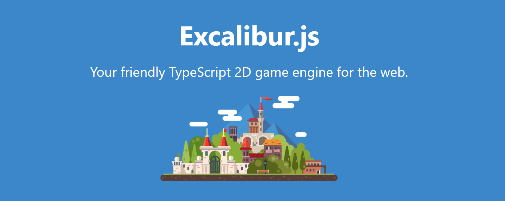
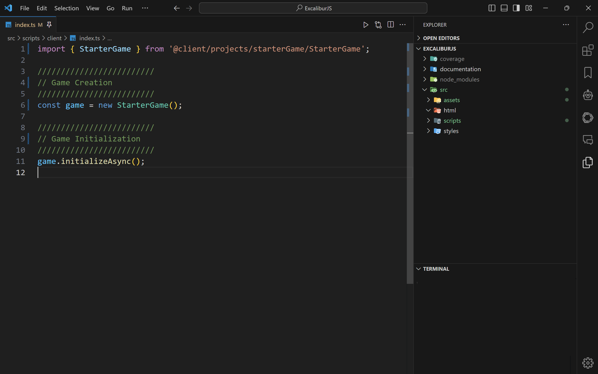
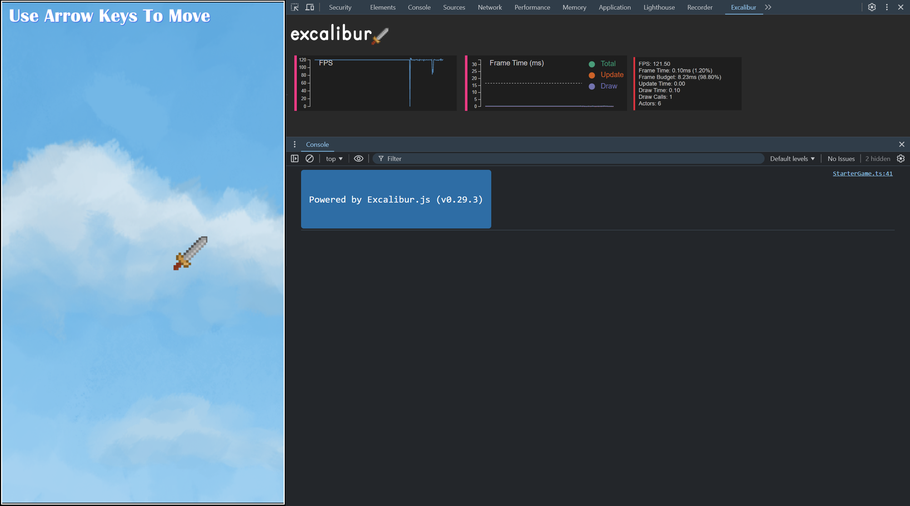

# ExcaliburJS Project Template

This repo is ideal for new [ExcaliburJS](https://excaliburjs.com/) projects using [TypeScript](https://www.typescriptlang.org/) and [Vite](https://vitejs.dev/).

Read a full [ExcaliburJS Project Template](https://samuel-asher-rivello.medium.com/html5-07-excaliburjs-project-template-c150fabaa027) Medium article about this repo.

<figure>

<figcaption>Image 1 - ExcaliburJS Game Engine - HTML5 + WebGL</figcaption>
</figure>

### Table of Contents

1. [Getting Started](#getting-started)
2. [Project Overview](#project-overview)
3. [Project Details](#project-details)
4. [Resources](#resources)
5. [Credits](#credits)

 

# Getting Started

### Play Project

1. See game at [SamuelAsherRivello.github.io/excaliburjs-project-template/index.html](https://samuelasherrivello.github.io/excaliburjs-project-template/index.html)
2. See docs at [SamuelAsherRivello.github.io/excaliburjs-project-template/documentation/index.html](https://samuelasherrivello.github.io/excaliburjs-project-template/documentation/index.html)
3. Enjoy!

### Build Project

1. Download this repo (_.zip or _.git)
2. Open the `ExcaliburJS` folder in the command line:
3. Install dependencies:
   - Run `npm install` to download and install dependencies.
4. Build the project:
   - Run `npm run client-build` to build the project.
5. Run the project:
   - Run `npm run client-start-watch` to launch a server to localhost. This serves the development build and hot-reloads on changes within the **src**.
6. Play the game at [localhost:3000](http://localhost:3000)
7. Open the `ExcaliburJS` folder in [Visual Studio Code](https://code.visualstudio.com/) or your favorite editor
8. Do your game development
9. Optional: When you add/update files within the `ExcaliburJS` folder, you may need to repeat step 4.
10. Optional: [Host](https://pages.github.com/) your project online and share the link with friends!
11. Enjoy!

 

### More Commands

You can run these terminal commands during your workflows.

| Command                             | Description                     | Required? | Installs | Builds | Runs | Tests | Watches | Publishes |
| ----------------------------------- | ------------------------------- | --------- | -------- | ------ | ---- | ----- | ------- | --------- |
| `npm` `install`                  | Download dependencies           | ✅        | ✅       | ❌     | ❌   | ❌    | ❌      | ❌        |
| `npm run`   `client-start-watch` | Run app on localhost            | ✅        | ❌       | ❌     | ✅   | ❌    | ✅      | ❌        |
| `npm run`   `client-build`       | Build app                       | ❌        | ❌       | ✅     | ❌   | ❌    | ❌      | ❌        |
| `npm run`   `tests-start-watch`  | Run unit tests in watch mode    | ❌        | ❌       | ❌     | ❌   | ✅    | ✅      | ❌        |
| `npm run`   `client-publish`     | Upload game build & docs online | ❌        | ❌       | ❌     | ❌   | ✅    | ❌      | ✅        |
| `npm run`   `ci`                 | Continuous integration          | ❌        | ❌       | ❌     | ❌   | ✅    | ❌      | ❌        |
| `npm run`   `cd`                 | Continuous deployment           | ❌        | ❌       | ❌     | ❌   | ✅    | ❌      | ✅        |

 

# Project Overview

This repo demonstrates best practices for combining HTML5 technologies for game development in the browser using ExcaliburJS.
Use cases for this repo include light-weight prototypes, educational projects, and browser-based game development.

 

### Screenshots

 

<figure>

<figcaption>Image 2 - Editor Environment (File Explorer, Terminal, Code Editor)</figcaption>
</figure>

 
 
 

<figure>

<figcaption>Image 3 - Runtime Environment (Game, Dev Tools, Console)</figcaption>
</figure>

 
 

### Structure

**Documentation**

- `ReadMe.md` - The primary documentation for this repo
- `ExcaliburJS/documentation/` - More info specific to the project

**Configuration**

- `Game Engine` - [ExcaliburJS](https://excaliburjs.com/) is a 2D game engine for TypeScript

**Structure**

- `ExcaliburJS` - Main project folder
- `ExcaliburJS/index.html` - Main HTML5 file
- `ExcaliburJS/src/assets/` - User-facing game assets
- `ExcaliburJS/src/scripts/tests/` - Add unit testing files here
- `ExcaliburJS/src/scripts/client/index.ts` - Main TS file for game logic. Do your work here :)

**Dependencies**

- `ExcaliburJS/package.json` - Lists project dependencies and scripts. When you run `npm install` it installs whatever is here

 
 

# Project Details

 

### Editor Tooling

| Name                                                                                             | Description                                 | Runtime? | Edit Time? |
| ------------------------------------------------------------------------------------------------ | ------------------------------------------- | -------- | ---------- |
| [Visual Studio Code](https://code.visualstudio.com/)                                             | Source code editor                          | ❌       | ✅         |
| [ESLint extension](https://marketplace.visualstudio.com/items?itemName=dbaeumer.vscode-eslint)   | VS Code extension for linting JavaScript/TS | ❌       | ✅         |
| [Error Lens extension](https://marketplace.visualstudio.com/items?itemName=usernamehw.errorlens) | Highlights errors and warnings in VS Code   | ❌       | ✅         |

 

### Code Packages (Partial List)

| Name                                                   | Description                | Runtime? | Edit Time? |
| ------------------------------------------------------ | -------------------------- | -------- | ---------- |
| [ExcaliburJS](https://www.npmjs.com/package/excalibur) | Game engine for TypeScript | ✅       | ❌         |
| [Typescript](https://www.npmjs.com/package/typescript) | Compiles your TypeScript   | ❌       | ✅         |
| [Vite](https://vitejs.dev/)                            | Bundles your TypeScript    | ❌       | ✅         |
| [Vitest](https://vitest.dev/)                          | Unit tests your TypeScript | ❌       | ✅         |
| [Eslint](https://www.npmjs.com/package/eslint)         | Bug-fix your TypeScript    | ❌       | ✅         |
| [Prettier](https://prettier.io/)                       | Prettify your TypeScript   | ❌       | ✅         |

 
 

# Resources

Here are some resources which may be helpful with HTML5 game projects using ExcaliburJS:

### Samuel Asher Rivello

- [Html5–01 — Gaming Overview](https://samuel-asher-rivello.medium.com/html5-01-games-overview-0c4e27fd5077)
- [Html5–02 — PixiJS For Gaming](https://samuel-asher-rivello.medium.com/html5-02-pixijs-for-gaming-3989d0df396d)
- [Html5–03 — PixiJS Project Template](https://samuel-asher-rivello.medium.com/html5-03-pixijs-project-template-c6e8d5006371)
- [Html5–04 — Unit Testing For PixiJS Games](https://samuel-asher-rivello.medium.com/html5-04-unit-testing-for-pixijs-games-379f476424e3)
- [Html5–05 — ExcaliburJS Overview](https://samuel-asher-rivello.medium.com/html5-05-excaliburjs-overview-ec5da2af4fcb)
- [Html5–06 — ExcaliburJS Critique](https://samuel-asher-rivello.medium.com/html5-05-excaliburjs-overview-502bf822c60b)
- [Html5–07 — ExcaliburJS Project Template](https://samuel-asher-rivello.medium.com/html5-07-excaliburjs-project-template-c150fabaa027)

### ExcaliburJS

- [ExcaliburJS Documentation](https://excaliburjs.com/docs/)
- [ExcaliburJS API Reference](https://excaliburjs.com/docs/api/)
- [ExcaliburJS Samples](https://excaliburjs.com/samples/)

 

# Credits

**Created By**

- Samuel Asher Rivello
- Over 25 years XP with game development (2024)
- Over 11 years XP with Unity (2024)

**Contact**

- Twitter - <a href="https://twitter.com/srivello/">@srivello</a>
- Git - <a href="https://github.com/SamuelAsherRivello/">Github.com/SamuelAsherRivello</a>
- Resume & Portfolio - <a href="http://www.SamuelAsherRivello.com">SamuelAsherRivello.com</a>
- LinkedIn - <a href="https://Linkedin.com/in/SamuelAsherRivello">Linkedin.com/in/SamuelAsherRivello</a> <--- Say Hello! :)

**License**

Provided as-is under MIT License | Copyright © 2024 Rivello Multimedia Consulting, LLC
